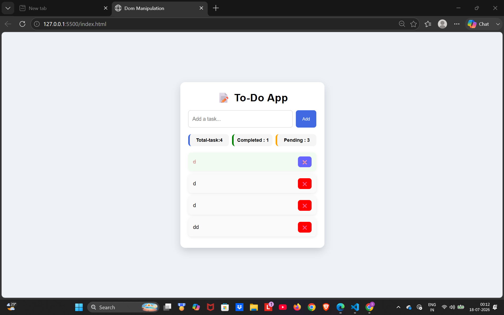

# 📝 To-Do App

A simple and responsive To-Do application built using HTML, CSS, and JavaScript.

## 📸 Screenshot



## 🚀 Features

- ✅ Add new tasks
- ✅ Delete tasks
- ✅ Mark tasks as completed
- ✅ Persistent storage using Local Storage
- ✅ Tasks remain after page refresh
- ✅ Live statistics:
  - Total Tasks
  - Completed Tasks
  - Pending Tasks

## 🛠️ Technologies Used

- HTML5
- CSS3
- JavaScript (ES6)
- Local Storage

## 📂 Project Structure

```
To-Do-App/
│── index.html
│── style.css
│── index.js
│── README.md
```

## 💡 Concepts Practiced

- DOM Manipulation
- Event Listeners
- Arrays & Objects
- Array Methods (`forEach`, `filter`, `splice`)
- Local Storage
- Dynamic Rendering
- CRUD Operations
- State Management

## 📸 Screenshot

(Add a screenshot of your app here later.)

## 🔮 Upcoming Features

- ✏️ Edit Task
- 🔍 Search Tasks
- 🎯 Filter Tasks (All / Completed / Pending)
- 🗑️ Clear Completed Tasks
- 🌙 Dark Mode

## 👨‍💻 Author

**Saurabh Kashyap**
